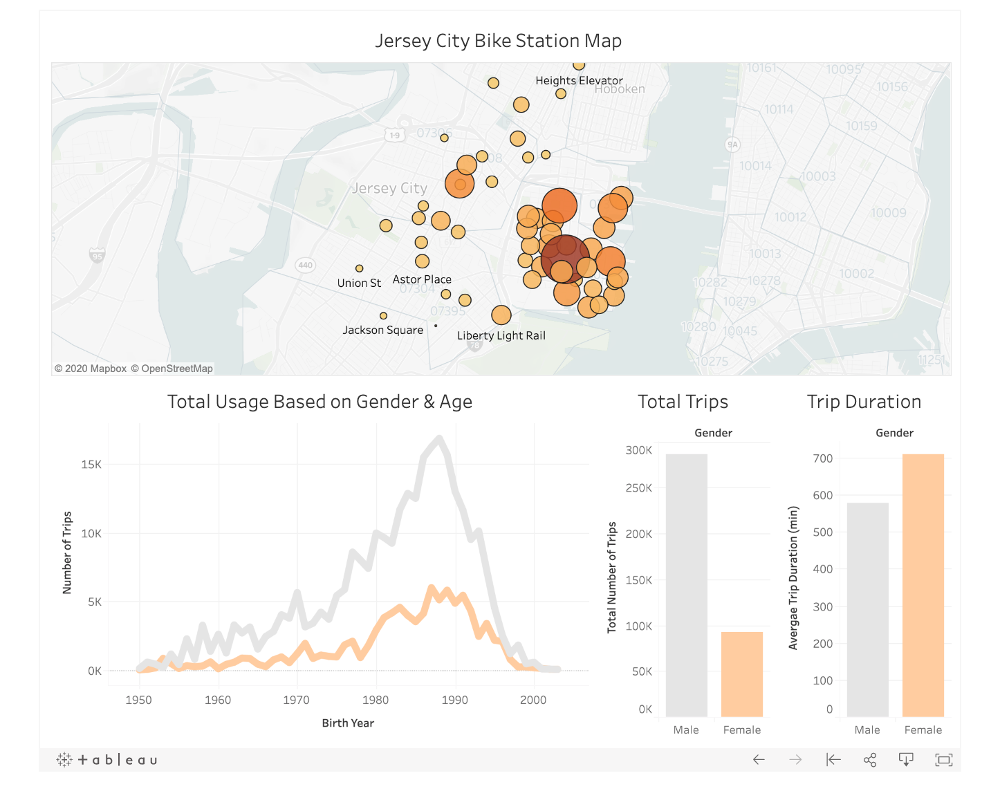
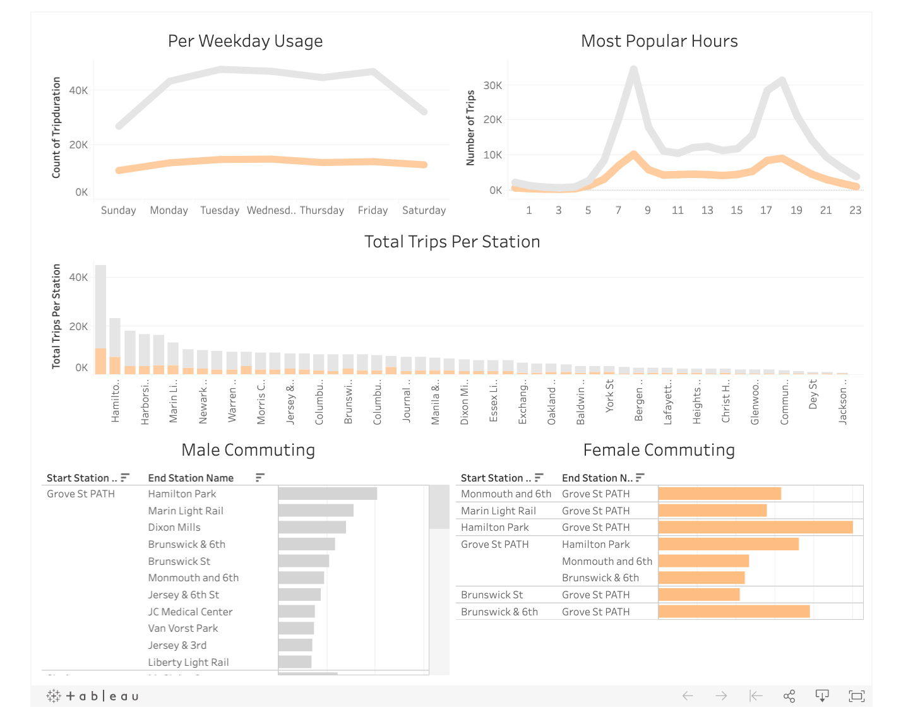

# CitiBike Usage: Why aren't females biking more? 

## Tableau Public Links: 
https://public.tableau.com/profile/katarzyna.kalemba#!/vizhome/CitibikeBigPicture/BigPicutre
https://public.tableau.com/profile/katarzyna.kalemba#!/vizhome/CitibikeBigPicture/Why?publish=yes

## Table of Contents
* [Summary](#summary)
* [Technologies](#technologies)
* [Motivation](#motivation)
* [Observed Trends](#observed-trends)
* [Final Thoughts](#final-thoughts)
* [Data Source](#data)
* [References](#references)

## Summary 
I analyzed the trends of CitiBike usage between females and males in Jersey City, New Jersey for all of 2019 using pandas to explore the data and subsequently Tableau to analyze it. 

## Technologies
* Python: pandas
[Jupyter Notebook](https://nbviewer.jupyter.org/github/kasiakalemba/CitiBike-Analysis-Tableau/blob/master/Data%20Exploration.ipynb)
* Tableau

## Motivation: 
As apartment sizes grow smaller in commuter hubs, the desire to live in the attractive areas such as Jersey City only grows bigger. One solution to saving space within an apartment and being a better commuter is the shared bike program like CitiBike. 

I recently started commuting to work on a bike and what I immediately noticed that I am the only woman in the morning biking. Every biker I pass is mostly a male. Therefore, I wanted to see if this is something specific to my area or also in more popular commuter cities. In this analysis, I looked that the usage of bikes between males and females using the public Citibike Jersey City Data from 2019.

## Observed Trends: 
The first map simply displays the distributions of stations based on total volume of trips taken. By far, we can see that Grove Street Path station is the busiest CitiBike site in the city.

* Below, I broke down the users based on age and gender. What was a striking finding is how much larger male usage is compared to female, independent of age. At first look, we see that the total number of trips taken is three times higher in males than in females, however, females show higher average trip durations. This made me look more into specific patterns of these trips.

* On the second dashboard, the first graph displays the trips taken based on the weekday. Looking at the female usage, we can see that it is fairly steady throughout the week while male usage sharply increases during the weekdays. This suggests that males are more likely using the shared biked system as a way to commute to work. The next graphs support that idea, as the sharpest increases in male bike usage occur during commuting hours. Although female usage also has a slight spike, it is nowhere near the male one.

* Next, I wanted to look at the breakdown of the most active stations by gender usage. Although male usage broken down by station was always higher than female usage, the Grove Street Path station had 55% more activity of the second highest one for the male group. This is not the case for females as it only increased a little over 30% from the second highest one. Grove Street Path station is the main junction between NJ and NY therefore this finding further supports the observation that male usage is related to communing.

* My last analysis focused on the volume of start and end stations trip being different suggesting more broad destinations for commuting. I only used stations above 1000 trips per gender to limit the data shown. Males showed a much higher number of start to end trips being different as well as a heavy trend toward commuting hubs such a Path stations. Females only showed 6 stations with that activity compared to 22 of males.

## Final Thoughts 
Throughout this data analysis what was striking to me, is how low female bike rental is compared to males. At first glance, it seems like males are using bikes heavily for commuting while female usage remains constant between the weekends and weekdays. Since the female bike duration is higher than the male, it appears that females are biking more leisurely. Looking more into the issue, I found articles exploring this in more depth. A Rutgers University professor Kelcie Ralph, studying this phenomenon, identified that the issue is related to safety. She compared it to the usage of bikes in the Netherlands where there is a 50/50 breakdown of usage. However, their cities are a lot safer than ours and promote bike safety through special lanes and a more friendly set up for daily biking. 

Although this phenomenon was observed many years back, the usage remains low until this day. It seems like Citibike has not done much to address this issue. One of their initiatives is Women's Bike Month which encourages women to bike and donates a portion of the funds. Since safety seems to be of main concern, I contend that the best solution would be to incorporate safer bike lanes in big commuter cities. A potential employer or CitiBike's discount for rentals could perhaps increase that number. The solution exists in other countries therefore it seems to be more a systemic issue that needs to be addressed in terms of safety.  

## Data: 
[CitiBike](https://www.citibikenyc.com/system-data)

## References: 
* [The Cut](https://www.thecut.com/2015/07/why-arent-more-women-riding-citi-bikes.html)
* [Gothamist](https://gothamist.com/news/why-do-so-few-women-use-citi-bike)
* [CitiBike](https://www.citibikenyc.com/blog/womens-bike-month)

